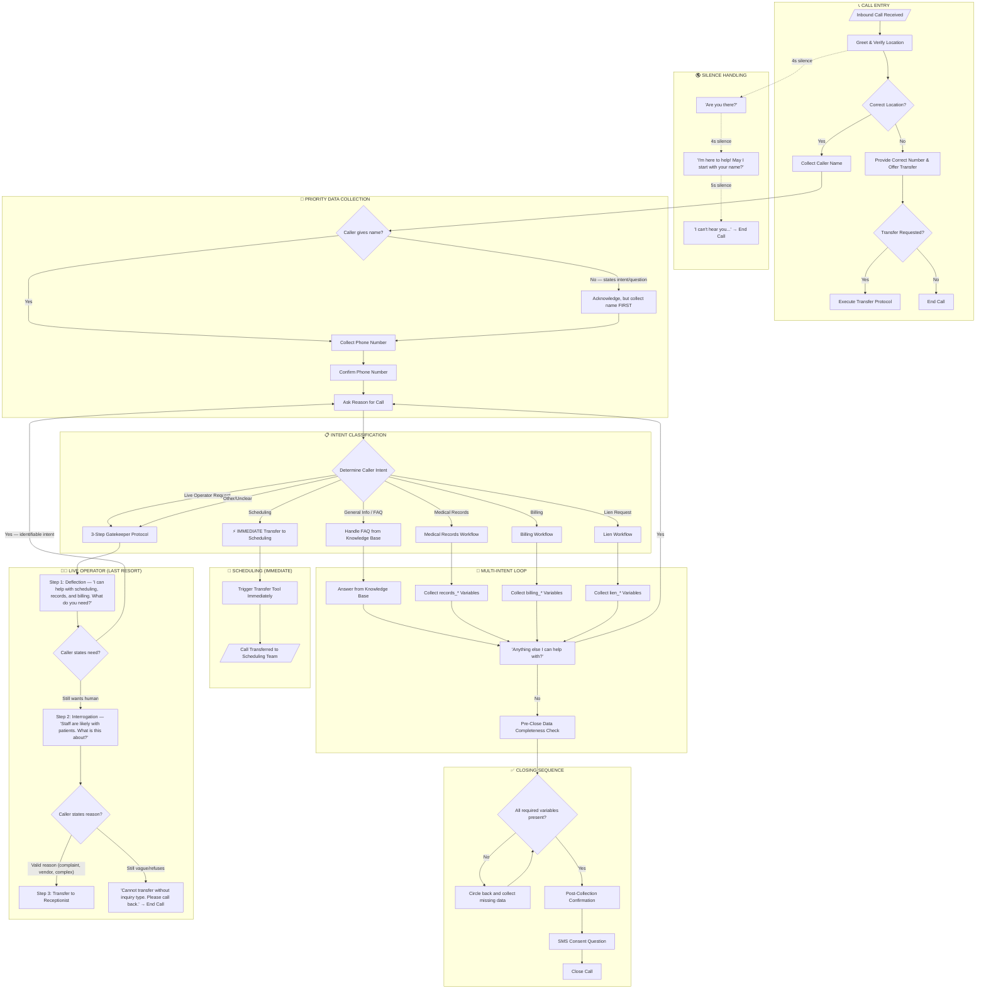
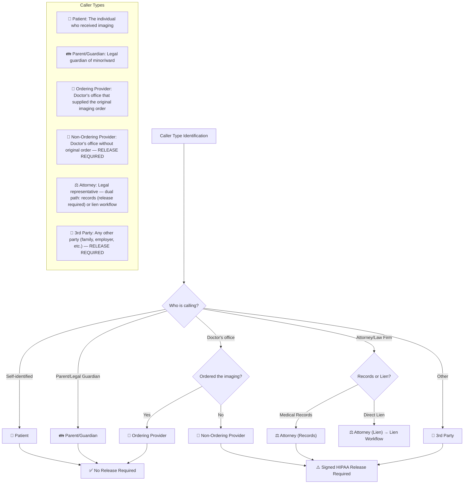
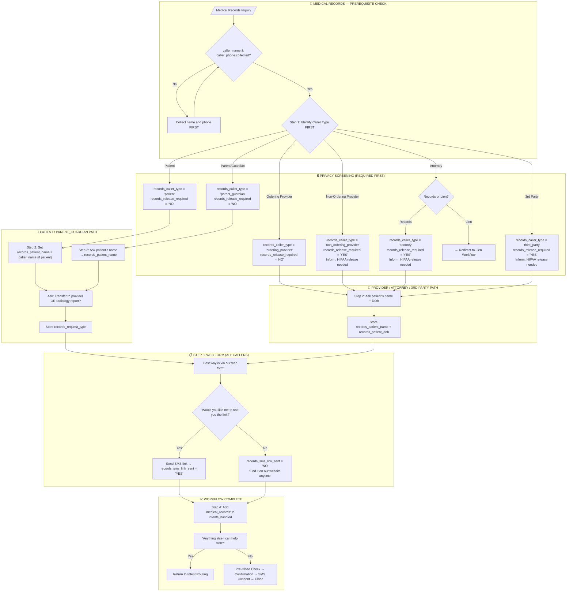
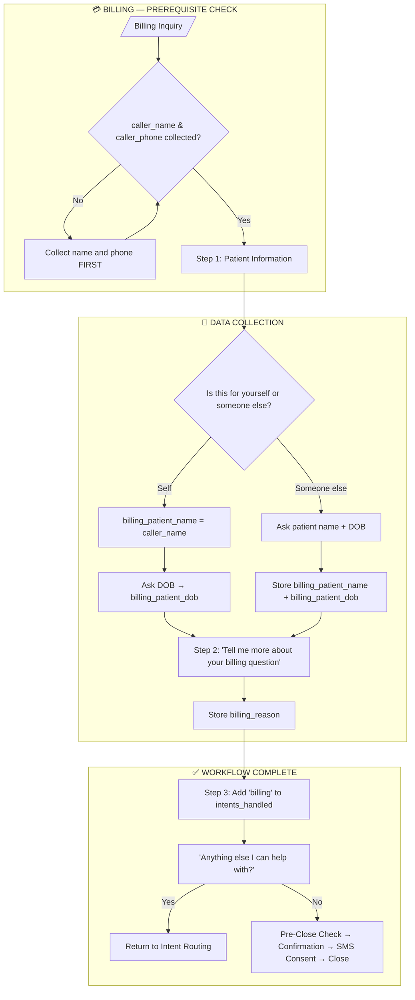
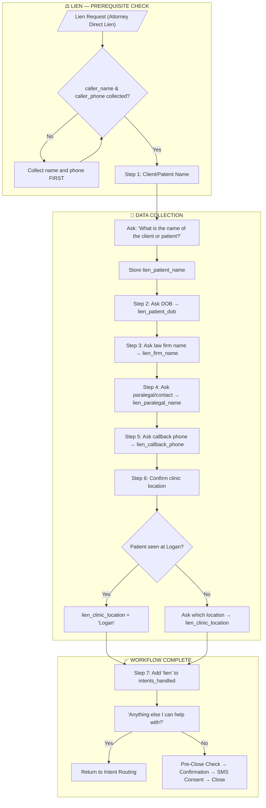
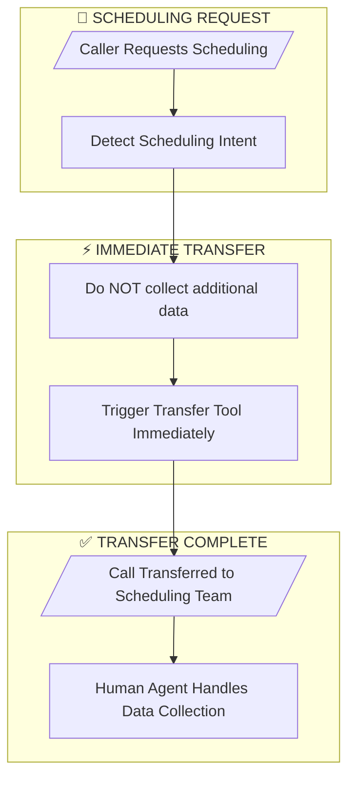
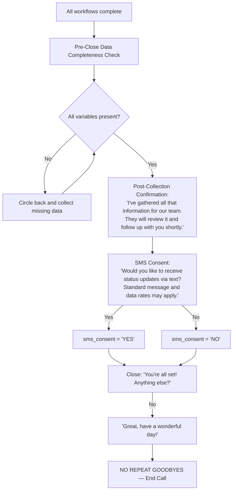
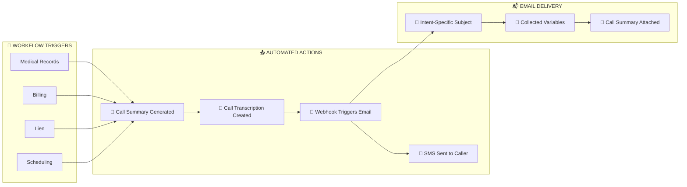
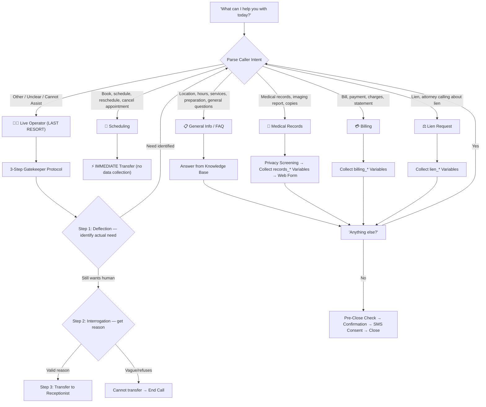
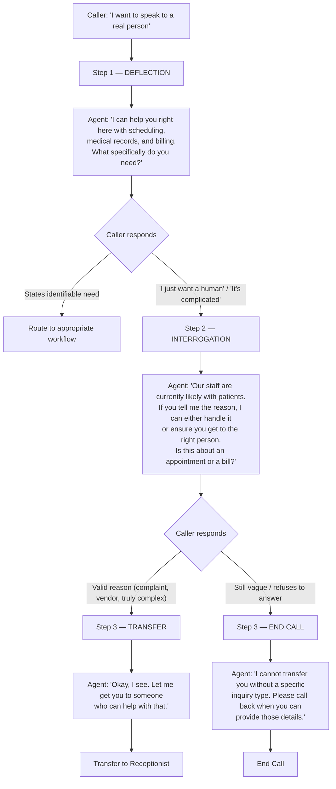

# Logan Clinic AI Voice Agent — Inbound Call Workflow Diagram

> **Clinic:** Logan MRI Clinic
> **Version:** 3.8
> **Last Updated:** February 27, 2026

---

## Overview

This document provides a comprehensive workflow diagram for the AI voice agent handling inbound calls to First Choice Imaging's Logan MRI Clinic. The workflow covers caller intent classification, caller type identification, information collection, multi-intent support, and post-call actions.

**Key Features:**
- **Multi-Intent Support:** Callers can address multiple intents in a single call (e.g., Medical Records + Billing + Lien)
- **Prefixed Variables:** Each intent uses prefixes (`records_`, `billing_`, `lien_`) to prevent overwrites
- **Immediate Scheduling Transfers:** No data collection — triggers transfer tool immediately
- **Intent Tracking:** `{{intents_handled}}` tracks completed workflows
- **Live Operator Fallback:** Last-resort transfer to human receptionist (3-step gatekeeper protocol)
- **Web Form Flow:** Medical records requests are directed to a web form via SMS link
- **SMS Consent:** Caller is asked to opt in/out of text status updates before closing
- **Pre-Close Data Completeness Check:** Agent silently verifies all required variables before ending

---

## Master Workflow Diagram (Multi-Intent Support)

---

## Caller Type Identification

---

## Medical Records Workflow (records_* prefix)

> **CRITICAL:** Caller type must be identified BEFORE collecting any patient information (privacy screening).

### Medical Records Variables

| Variable | Required | Condition | Notes |
|----------|----------|-----------|-------|
| `{{records_caller_type}}` | Always | — | "patient", "parent_guardian", "ordering_provider", "non_ordering_provider", "attorney", "third_party" |
| `{{records_release_required}}` | Always | Auto-set | "YES" or "NO" based on caller_type |
| `{{records_patient_name}}` | Always | — | = caller_name if patient; asked otherwise |
| `{{records_request_type}}` | Conditional | Patient or Parent/Guardian only | "transfer_to_provider" or "radiology_report" |
| `{{records_patient_dob}}` | Conditional | Provider, Attorney, or 3rd Party only | YYYY-MM-DD format |
| `{{records_sms_link_sent}}` | Always | — | "YES" or "NO" |

---

## Billing Inquiry Workflow (billing_* prefix)

### Billing Variables

| Variable | Required | Notes |
|----------|----------|-------|
| `{{billing_patient_name}}` | Always | = caller_name if self; asked otherwise |
| `{{billing_patient_dob}}` | Always | YYYY-MM-DD format |
| `{{billing_reason}}` | Always | Reason for billing inquiry |

---

## Lien Request Workflow (lien_* prefix)

> **Entry Point:** Caller is routed here from the Attorney branch in Medical Records Step 1 when they indicate they want to establish a direct lien.

### Lien Variables

| Variable | Required | Notes |
|----------|----------|-------|
| `{{lien_patient_name}}` | Always | Client/patient's full name |
| `{{lien_patient_dob}}` | Always | Client/patient's DOB (YYYY-MM-DD) |
| `{{lien_firm_name}}` | Always | Name of the law firm |
| `{{lien_paralegal_name}}` | Always | Point of contact or paralegal |
| `{{lien_callback_phone}}` | Always | Best callback number for the firm |
| `{{lien_clinic_location}}` | Always | Clinic where patient was seen |

---

## Scheduling Transfer Workflow (IMMEDIATE TRANSFER)

> **⚡ IMPORTANT:** When a caller requests scheduling, the agent triggers the transfer tool **immediately** without collecting additional data. The human scheduling team handles all data collection.

**Key Points:**
- No patient name, DOB, or imaging service collected by AI
- Universal variables (`{{caller_name}}`, `{{caller_phone}}`) already captured in Steps 1-2
- Reduces caller wait time and improves handoff experience

---

## Pre-Close Data Completeness Check

> **CRITICAL:** Before confirming and closing, the agent silently verifies ALL required variables for each completed intent.

### Checklist by Intent

**Universal (always required):**
- [ ] `{{caller_name}}`
- [ ] `{{caller_phone}}`
- [ ] `{{sms_consent}}` (asked during closing)

**If `{{intents_handled}}` contains "medical_records":**
- [ ] `{{records_caller_type}}`
- [ ] `{{records_patient_name}}`
- [ ] `{{records_request_type}}` — if patient or parent_guardian only
- [ ] `{{records_patient_dob}}` — if ordering_provider, non_ordering_provider, attorney, or third_party only
- [ ] `{{records_sms_link_sent}}`

**If `{{intents_handled}}` contains "billing":**
- [ ] `{{billing_patient_name}}`
- [ ] `{{billing_patient_dob}}`
- [ ] `{{billing_reason}}`

**If `{{intents_handled}}` contains "lien":**
- [ ] `{{lien_patient_name}}`
- [ ] `{{lien_patient_dob}}`
- [ ] `{{lien_firm_name}}`
- [ ] `{{lien_paralegal_name}}`
- [ ] `{{lien_callback_phone}}`
- [ ] `{{lien_clinic_location}}`

**If any required variable is missing:** Circle back naturally before closing.

---

## Closing Sequence

---

## Post-Call Actions Summary

---

## Email Notifications

| Intent | Email Subject Pattern |
|--------|----------------------|
| Medical Records | `[RECORDS] Patient: {{records_patient_name}}` |
| Billing | `[BILLING] Patient: {{billing_patient_name}}` |
| Lien | `[LIEN] Patient: {{lien_patient_name}}` |

> **Contents:** Each email includes all collected variables for the specific intent type, plus call summary and transcription.

---

## Data Collection Requirements by Intent

> **Variable Naming Convention:** Intent-specific variables use prefixes (`records_`, `billing_`, `lien_`) to support multi-intent calls without variable overwrites.

### Universal Variables (All Calls)

| Variable | Field | Data Type | Required | Notes |
|----------|-------|-----------|----------|-------|
| `{{caller_name}}` | Caller Name | string | Yes | Full name of person calling (Step 1) |
| `{{caller_phone}}` | Caller Phone | string | Yes | Best contact number (Step 2) |
| `{{caller_email}}` | Caller Email | string | Yes | Collected before closing |
| `{{intents_handled}}` | Intents Handled | string (comma-separated) | Auto-set | e.g., "medical_records,billing" — tracks completed workflows |
| `{{sms_consent}}` | SMS Consent | string | Yes | "YES" or "NO" — text status update opt-in |

### Scheduling Request (IMMEDIATE TRANSFER)

| Variable | Field | Data Type | Required | Notes |
|----------|-------|-----------|----------|-------|
| ⚡ **NO ADDITIONAL DATA COLLECTED** | — | — | — | Immediate transfer to scheduling team |

### Medical Records Request (records_* prefix)

| Variable | Field | Data Type | Required | Notes |
|----------|-------|-----------|----------|-------|
| `{{records_caller_type}}` | Caller Type | enum | Always | "patient", "parent_guardian", "ordering_provider", "non_ordering_provider", "attorney", "third_party" |
| `{{records_release_required}}` | Release Required | string | Auto-set | "YES" or "NO" — based on caller_type |
| `{{records_patient_name}}` | Patient Name | string | Always | = caller_name if patient; asked otherwise |
| `{{records_request_type}}` | Request Type | enum | Conditional | Patient/Parent_Guardian only: "transfer_to_provider" or "radiology_report" |
| `{{records_patient_dob}}` | Patient DOB | string (YYYY-MM-DD) | Conditional | Provider/Attorney/3rd Party only |
| `{{records_sms_link_sent}}` | SMS Link Sent | string | Always | "YES" or "NO" — web form link texted? |

### Billing Inquiry (billing_* prefix)

| Variable | Field | Data Type | Required | Notes |
|----------|-------|-----------|----------|-------|
| `{{billing_patient_name}}` | Patient Name | string | Always | = caller_name if self; asked otherwise |
| `{{billing_patient_dob}}` | Patient DOB | string (YYYY-MM-DD) | Always | Patient's date of birth |
| `{{billing_reason}}` | Reason for Call | string | Always | Specific billing inquiry details |

### Lien Request (lien_* prefix)

| Variable | Field | Data Type | Required | Notes |
|----------|-------|-----------|----------|-------|
| `{{lien_patient_name}}` | Patient Name | string | Always | Client/patient's full name |
| `{{lien_patient_dob}}` | Patient DOB | string (YYYY-MM-DD) | Always | Client/patient's date of birth |
| `{{lien_firm_name}}` | Law Firm | string | Always | Name of the law firm |
| `{{lien_paralegal_name}}` | Contact Name | string | Always | Paralegal or point of contact |
| `{{lien_callback_phone}}` | Callback Phone | string | Always | Best number for the firm |
| `{{lien_clinic_location}}` | Clinic Location | string | Always | Where patient was seen |

---

## Caller Intent Decision Tree

---

## Live Operator Transfer (Last Resort)

> **⚠️ CRITICAL:** The Live Operator transfer is a **LAST RESORT** option. The agent must exhaust all other options before offering this transfer.

### 3-Step Gatekeeper Protocol

### When to Use

| Scenario | Action |
|----------|--------|
| Caller asks for "live person" at start of call | Do NOT transfer — Step 1 Deflection |
| Caller has complaint or escalation | Transfer to `Receptionist` after Step 2 |
| Complex situation outside standard workflows | Transfer to `Receptionist` after Step 2 |
| Caller confused/frustrated after multiple attempts | Transfer to `Receptionist` |
| Non-imaging request (vendor, job inquiry) | Transfer to `Receptionist` after Step 2 |

### Transfer Phrase

When transferring to Live Operator after exhausting options:
> *"I want to make sure you get the help you need. Let me connect you with one of our staff members who can assist further. Just one moment."*

---

## Transfer Execution Protocol (Cross-Location Transfers)

> **EXCEPTION:** Scheduling transfers are IMMEDIATE — skip this protocol.

**Turn 1: Offer & Satisfaction Check**
1. Finish answering the current question completely.
2. Offer the transfer: *"I'd be happy to get you over to our [department] team. Before I connect you, is there anything else I can answer for you?"*
3. **STOP.** Wait for the caller to respond.

**Turn 2: Bridge & Trigger (Only after caller says "No/That's it")**
1. If the caller has more questions, answer them and repeat Turn 1.
2. If ready: *"Alright, I'm going to get you over to our [department] team now. Just one moment while I connect you."*
3. Wait 2 seconds of silence.
4. Trigger transfer action.

---

## Cross-Location Phone Directory & Transfer Triggers

| Location | Phone Number | Transfer Trigger |
|----------|--------------|------------------|
| Tooele Valley Imaging | (435) 882-1674 | Transfer to `Tewilla` |
| Sandy (Wasatch Imaging) | (801) 576-1290 | Transfer to `Sandy` |

| Department | Transfer Trigger | Notes |
|------------|------------------|-------|
| Scheduling | Transfer to `Scheduling` | IMMEDIATE — no data collection |
| Live Operator | Transfer to `Receptionist` | LAST RESORT — exhaust all options first |

---

## Cross-Reference: Other Clinic Locations

| Location | Phone Number | Services |
|----------|--------------|----------|
| Logan MRI Clinic | (435) 258-9598 | Wide Bore MRI, Arthrograms |
| North Logan CT Clinic | (435) 258-9598 | CT Scans, Lung Cancer Screening |
| Tooele Valley Imaging | (435) 882-1674 | MRI, CT |
| Sandy (Wasatch Imaging) | (801) 576-1290 | MRI, CT |
| St. George | — | MRI, CT |

> **Note:** CT inquiries at the Logan number should be handled directly (North Logan CT Clinic shares the same phone line).

---

## Multi-Intent Call Example

**Scenario:** Caller needs medical records AND has a billing question.

1. **Records Workflow:** Agent identifies caller type, collects `records_*` variables, directs to web form
2. Agent asks: *"Anything else I can help with?"*
3. Caller mentions billing question
4. **Billing Workflow:** Agent collects `billing_*` variables
5. Agent asks: *"Anything else I can help with?"*
6. Caller says no
7. **Pre-Close Check:** Agent verifies all variables present
8. **Post-Collection Confirmation:** "I've gathered all that information for our team..."
9. **SMS Consent:** "Would you like to receive status updates via text?"
10. Agent closes call

**Final `{{intents_handled}}`:** `"medical_records,billing"`

This allows downstream webhooks to route notifications based on which intents were handled.

---

*Document Version: 3.8*
*Location: Logan MRI Clinic*
*Last Updated: February 27, 2026*
