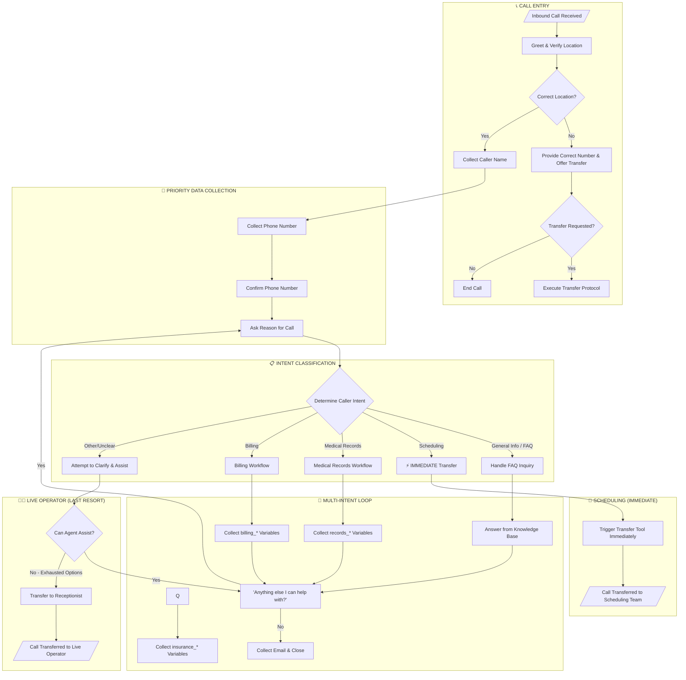
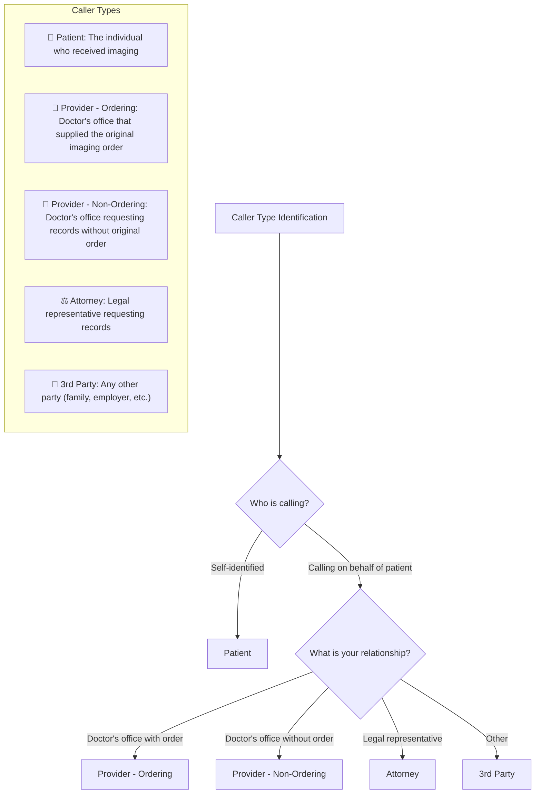
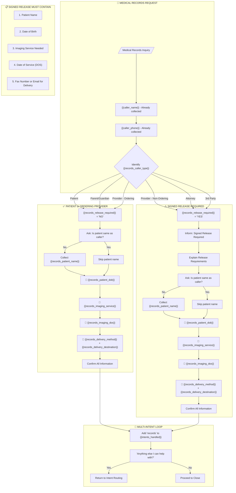
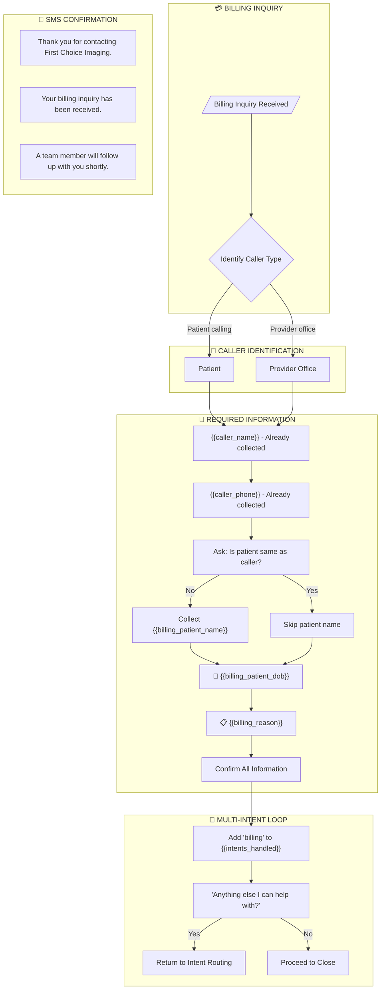
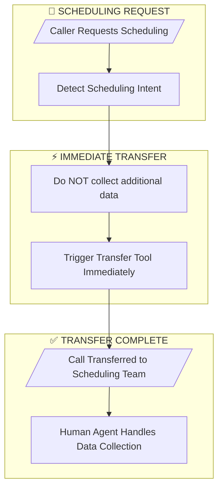
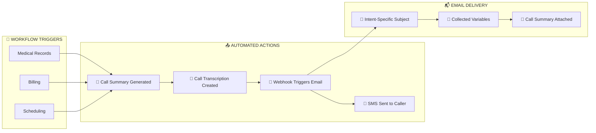
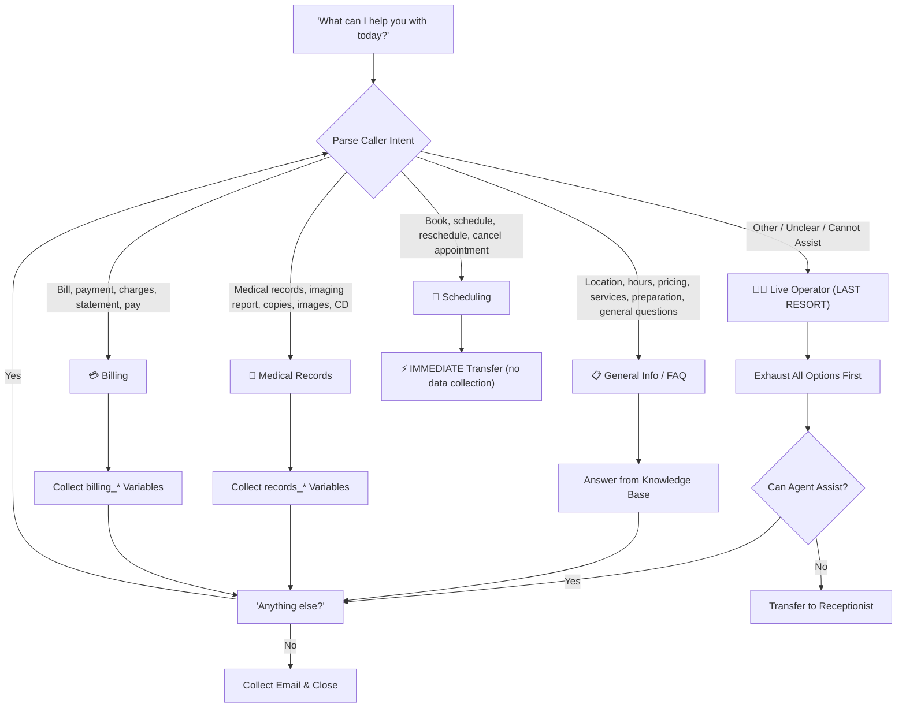
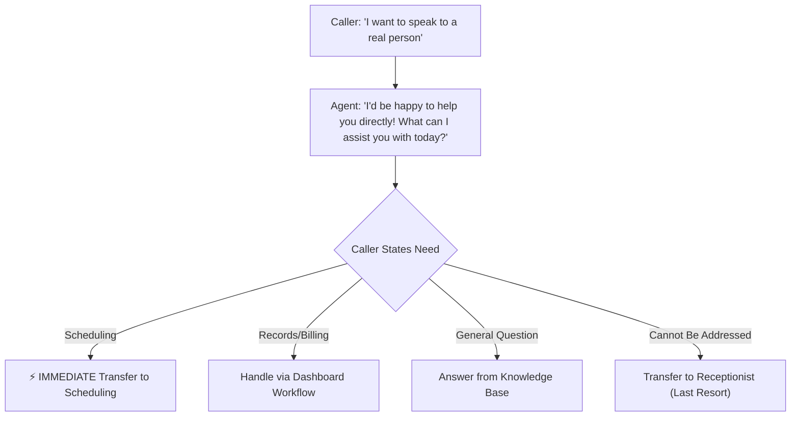

# Logan Clinic AI Voice Agent — Inbound Call Workflow Diagram

> **Clinic:** Logan MRI Clinic
> **Version:** 2.5
> **Last Updated:** February 5, 2026

---

## Overview

This document provides a comprehensive workflow diagram for the AI voice agent handling inbound calls to First Choice Imaging's Logan MRI Clinic. The workflow covers caller intent classification, caller type identification, information collection, multi-intent support, and post-call actions.

**Key Features:**
- **Multi-Intent Support:** Callers can address multiple intents in a single call
- **Prefixed Variables:** Each intent uses prefixes (`records_`, `billing_`) to prevent overwrites
- **Immediate Scheduling Transfers:** No data collection — triggers transfer tool immediately
- **Intent Tracking:** `{{intents_handled}}` tracks completed workflows
- **Live Operator Fallback:** Last-resort transfer to human receptionist (only after exhausting all options)

---

## Master Workflow Diagram (Multi-Intent Support)



---

## Caller Type Identification



---

## Medical Records Workflow (records_* prefix)



---

## Billing Inquiry Workflow (billing_* prefix)



---


## Scheduling Transfer Workflow (IMMEDIATE TRANSFER)

> **⚡ IMPORTANT:** When a caller requests scheduling, the agent triggers the transfer tool **immediately** without collecting additional data. The human scheduling team handles all data collection.



**Key Points:**
- No patient name, DOB, or imaging service collected by AI
- Universal variables (`{{caller_name}}`, `{{caller_phone}}`) already captured in Steps 1-2
- Reduces caller wait time and improves handoff experience

---

## Post-Call Actions Summary



---

## Email Notifications

| Intent | Email Subject Pattern |
|--------|----------------------|
| Medical Records | `[RECORDS] Patient: {{records_patient_name}}` |
| Billing | `[BILLING] Patient: {{billing_patient_name}}` |


> **Contents:** Each email includes all collected variables for the specific intent type, plus call summary and transcription.

---

## Data Collection Requirements by Intent

> **Variable Naming Convention:** Intent-specific variables use prefixes (`records_`, `billing_`) to support multi-intent calls without variable overwrites.

### Universal Variables (All Calls)

| Variable | Field | Data Type | Required | Notes |
|----------|-------|-----------|----------|-------|
| `{{caller_name}}` | Caller Name | string | Yes | Full name of person calling (Step 1) |
| `{{caller_phone}}` | Caller Phone | string | Yes | Best contact number (Step 2) |
| `{{caller_email}}` | Caller Email | string | Yes | Collected before closing |
| `{{caller_reason}}` | Reason for Call | string | Yes | Initial stated reason (Step 3) |
| `{{intents_handled}}` | Intents Handled | string (comma-separated) | Auto-set | e.g., "records, billing" — tracks completed workflows |

### Scheduling Request (IMMEDIATE TRANSFER)

| Variable | Field | Data Type | Required | Notes |
|----------|-------|-----------|----------|-------|
| ⚡ **NO ADDITIONAL DATA COLLECTED** | — | — | — | Immediate transfer to scheduling team |


### Billing Inquiry (billing_* prefix)

| Variable | Field | Data Type | Required | Notes |
|----------|-------|-----------|----------|-------|
| `{{billing_patient_name}}` | Patient Name | string | Conditional | Only if different from caller |
| `{{billing_patient_dob}}` | Patient DOB | string (YYYY-MM-DD) | Yes | Patient's date of birth |
| `{{billing_reason}}` | Reason for Call | string | Yes | Specific billing inquiry details |

### Medical Records Request (records_* prefix)

| Variable | Field | Data Type | Required | Notes |
|----------|-------|-----------|----------|-------|
| `{{records_patient_name}}` | Patient Name | string | Conditional | Only if different from caller |
| `{{records_patient_dob}}` | Patient DOB | string (YYYY-MM-DD) | Yes | Patient's date of birth |
| `{{records_imaging_service}}` | Imaging Service | string | Yes | Type of imaging performed |
| `{{records_imaging_dos}}` | Imaging DOS | string (YYYY-MM-DD) | Yes | Date of service |
| `{{records_delivery_method}}` | Delivery Method | enum | Yes | "email" or "fax" |
| `{{records_delivery_destination}}` | Email/Fax | string | Yes | Where to send records |
| `{{records_caller_type}}` | Caller Type | enum | Yes | Relationship to patient |
| `{{records_release_required}}` | Release Required | **string** | Auto-set | **"YES" or "NO"** — Based on caller_type |

---

## Signed Release Requirements

> [!IMPORTANT]
> A signed release is **required** for the following caller types requesting medical records:
> - Provider (Non-Ordering)
> - Attorney
> - 3rd Party

### Required Contents of Signed Release

1. **Patient Name** — Full legal name matching imaging records
2. **Date of Birth** — For patient verification
3. **Imaging Service Needed** — Specific exam type
4. **Date of Service (DOS)** — Date or date range of imaging
5. **Fax Number or Email** — Where records should be sent

---

## Caller Intent Decision Tree



---

## Live Operator Transfer (Last Resort)

> **⚠️ CRITICAL:** The Live Operator transfer is a **LAST RESORT** option. The agent must exhaust all other options before offering this transfer.

### When to Use

| Scenario | Action |
|----------|--------|
| Caller asks for "live person" at start of call | Do NOT transfer — ask what they need and attempt to assist |
| Caller has complaint or escalation | Transfer to `Receptionist` after attempting to understand |
| Complex situation outside standard workflows | Transfer to `Receptionist` after clarifying questions |
| Caller confused/frustrated after multiple attempts | Transfer to `Receptionist` |
| Non-imaging request (vendor, job inquiry) | Transfer to `Receptionist` |

### Anti-Gaming Protocol



### Transfer Phrase

When transferring to Live Operator after exhausting options:
> *"I want to make sure you get the help you need. Let me connect you with one of our staff members who can assist further. Just one moment."*

---

## SMS Follow-Up Templates

### Medical Records SMS
```
Hi [Caller Name], thank you for contacting First Choice Imaging regarding your medical records request. 
Your request has been received and will be processed by our team. 
We'll be in touch soon.
```

### Billing SMS
```
Hi [Caller Name], thank you for your billing inquiry with First Choice Imaging. 
Our billing team has received your information and will follow up shortly. 

```


## Cross-Reference: Other Clinic Locations

| Location | Phone Number | Services |
|----------|--------------|----------|
| Logan MRI Clinic | (435) 258-9598 | Wide Bore MRI, Arthrograms |
| North Logan CT Clinic | (435) 258-9598 | CT Scans, Lung Cancer Screening |
| Tooele Valley Imaging | (435) 882-1674 | MRI, CT |
| Sandy (Wasatch Imaging) | (801) 576-1290 | MRI, CT |
| St. George | — | MRI, CT |

---

*Document Version: 2.7*
*Location: Logan MRI Clinic*
*Last Updated: February 5, 2026*

---

## Multi-Intent Call Example

**Scenario:** Caller needs both medical records AND has a billing question.

1. **Records Workflow:** Agent collects `records_*` variables
2. Agent asks: *"Anything else I can help with?"*
3. Caller mentions billing question
4. **Billing Workflow:** Agent collects `billing_*` variables
5. Agent asks: *"Anything else I can help with?"*
6. Caller says no
7. Agent collects email and closes call

**Final `{{intents_handled}}`:** `"records, billing"`

This allows downstream webhooks to route emails based on which intents were handled.
